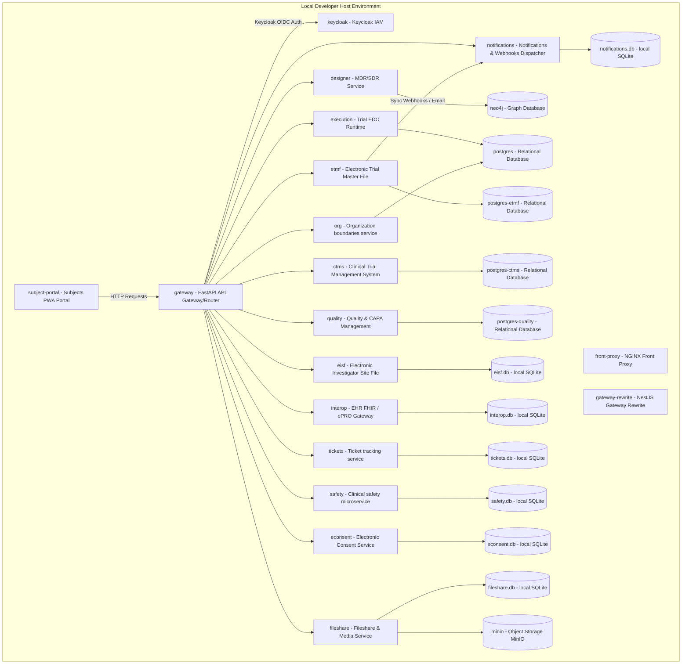

# Architecture Specification: Cadence Clinical Research Software

## 1. System Vision & Problem Statement

Traditional clinical trial builds require manual, error-prone translation of protocol documents into downstream EDC systems. This causes multi-month setup delays, risk of discrepancies between protocols and CRFs, and expensive amendment re-work.

**Cadence Clinical Research Software** solves this by establishing a single, metadata-driven source of truth that automates the generation of downstream trial infrastructure directly from digitized protocol definitions.

---

## 2. Core Service Domains

### A. Designer Service (`apps/designer`)

- **Role:** Study Definition Repository (SDR) and Clinical Metadata Repository (MDR).
- **Datastore:** Neo4j Graph Database.
- **Core Responsibilities:**
  - Protocol structure authoring (Arms, Epochs, Branches, Visits).
  - Schedule of Activities (SoA) matrix generation.
  - CDISC USDM export endpoints.
  - Fine-grained protocol semantic versioning and amendment diffing.

### B. Execution Engine (`apps/execution`)

- **Role:** Electronic Data Capture (EDC) Runtime.
- **Datastore:** PostgreSQL Relational Database.
- **Core Responsibilities:**
  - Automatic generation of eCRF layouts and validation rules from USDM specifications.
  - Subject enrollment, matrix tracking, and event scheduling.
  - Real-time edit-check evaluation during site data entry.
  - Discrepancy (query) workflow management.
  - Authenticated SDTM/ADaM Dataset-JSON export, structural/referential export validation, and BiostatExport audit logging.

### C. Web Client (`apps/web`)

- **Role:** Primary User Interface.
- **Core Responsibilities:**
  - Renders standard clinical forms directly from XML payloads compiled by the backend translation engine.
  - Provides site investigators and data managers a unified interface for data entry and clinical study management.

### D. Shared UI Components (`packages/ui`)

- **Role:** Design System Library.
- **Core Responsibilities:**
  - Provides reusable, standardized UI components (e.g., inputs, layouts) ensuring design consistency.
  - Shared seamlessly across frontend packages using the pnpm workspace protocol.

### E. Clinical Metadata Validation & Translation (`apps/designer` and `apps/execution`)

- **Role:** Unified Standard Domain Modeling & Validation.
- **Core Responsibilities:**
  - Official CDISC USDM standard representation using the `usdm` package inside the Designer (`apps/designer/`).
  - In-memory bidirectional transformation adapters (USDM JSON ↔ OpenRosa / CDISC ODM) in the Execution engine (`apps/execution/`).

### F. Gateway & Identity (`apps/gateway`)

- **Role:** Reverse Proxy & Access Control.
- **Core Responsibilities:**
  - Keycloak OIDC JWT validation.
  - Centralized Role-Based Access Control (RBAC) mapping:
    - `Study Designer` ──► Design permissions in `apps/designer`
    - `Site Investigator / CRC` ──► Data capture permissions in `apps/execution`
    - `Data Manager` ──► Query and form management across both domains.
    - `Monitor` ──► Monitoring, site verification, and CTMS operations in `apps/ctms`
    - `Grants Manager` ──► Budget, financials, and CTMS administrative operations in `apps/ctms`

### G. Event-Driven eTMF Module (`apps/etmf`)

- **Role:** Electronic Trial Master File (eTMF) Repository and Completeness Tracker.
- **Datastore:** SQLite / PostgreSQL Relational Database.
- **Core Responsibilities:**
  - Ingests, taxonomy-classifies, and versions clinical trial artifacts mapped to DIA TMF Reference Model Zones 1-11.
  - Implements Expected Document Lists (EDLs) through the `ExpectedDocument` data model to replace static, hardcoded milestone rules.
  - Computes site-aware, data-driven milestone completeness checks by querying active EDLs and combining study-scope and site-scope required artifacts.
  - Enforces role-based access control and trial lock restrictions via the Gateway and `GatewayAuthMiddleware` to block read-only inspector roles from mutating definitions or archives.
  - Maintains a 21 CFR Part 11 compliant audit trail (`TMFAuditLog`) capturing user contexts, timestamps, and justifications for all eTMF views, downloads, EDL updates, and completeness checks.

### H. Clinical Trial Management System (`apps/ctms`)

- **Role:** Administrative, Financial, Operational, and Monitoring Workspace.
- **Datastore:** SQLite / PostgreSQL Relational Database.
- **Core Responsibilities:**
  - Trial, site, and operational metadata tracking (recruitment, milestone verification).
  - Budget and investigator grant tracking across roles like Grants Manager.
  - Integration with Keycloak OIDC authentication via the secure API gateway.
  - Full 21 CFR Part 11 compliant auditing (`CTMSAuditLog`) recording all actions, view queries, and mutations with explicit change reasons.
  - Role-Based Access Control (RBAC) ensuring write mutations are restricted to roles like `Monitor`, `Grants Manager`, `CRA`, or `Admin`, and read-only queries are restricted to authorized operational personnel.

### I. Quality & CAPA Management Service (`apps/quality`)

- **Role:** Isolated Quality Assurance & Compliance Workspace.
- **Datastore:** SQLite / PostgreSQL Relational Database.
- **Core Responsibilities:**
  - Secure, relational protocol deviation tracking linked directly to systematic root causes and corrective/preventive action models.
  - Integration with Keycloak OIDC authentication via standard headers proxying through the secure API gateway.
  - Full 21 CFR Part 11 compliant mutable record auditing with mandatory `version_index` incrementing, standard creation/traceability metadata, and a non-empty change reason header (`X-Change-Reason`).
  - Immutable, append-only, chronological quality logs (`QualityAuditLog`) of all viewed records, updates, and transitions.
  - Restricts access to read-only roles (`auditor`, `inspector`, `regulatory_inspector`) from all mutating operations, gates general write access, and authorizes terminal CAPA approvals or closures only to Quality Oversight roles (`quality_manager`, `qa_lead`, `quality_oversight`, `admin`).

### J. Interoperability & Sync Gateway Service (`apps/interop`)

- **Role:** EHR FHIR Data Adapter & ePRO Submission Sync Gateway.
- **Datastore:** SQLite / PostgreSQL Relational Database.
- **Core Responsibilities:**
  - Ingests HL7 FHIR bundles, performs PII stripping and pseudonymization, and CDASH mappings to pre-fill observations.
  - Receives single or bulk ePRO/eCOA submissions from active study subjects.
  - Implements multi-strategy offline reconciliation (`CLIENT_WINS`, `SERVER_WINS`, `MERGE`) and isolates/logs conflict details in `EPROSubmissionDefeated`.
  - Triggers auditable open clinical queries automatically for submissions with structural mismatches.
  - Computes subject compliance schedules and triggers async background notifications (EMAIL, SMS, WEBHOOK, IN_APP).
  - Exposes secure least-privilege APIs for patient self-service (instrument details, assignments, compliance, and notification lists) and notification acknowledgement.

### K. Patient/Subject Portal (`apps/subject-portal`)

- **Role:** Standalone Patient-Facing ePRO Web Application.
- **Core Responsibilities:**
  - Serves as an isolated, secure Progressive Web App (PWA) client optimized for mobile environments.
  - Integrates with Keycloak OIDC for authenticated login under the strict `Subject` role.
  - Implements offline-first caching via service workers and queues signed submissions chronologically inside IndexedDB.
  - Provides a visual Sync Queue Panel allowing subjects to view transmission logs and online reconciliation decisions.
  - Supports read capabilities (assigned instruments, compliance rates, assignments, and notification inbox) and interactive notification acknowledgement alongside diary submit and sync operations.

### L. eISF Module (`apps/eisf`)

- **Role:** Electronic Investigator Site File (eISF) Repository.
- **Datastore:** SQLite / PostgreSQL Relational Database.
- **Core Responsibilities:**
  - Ingests, taxonomy-classifies, and versions clinical trial site documents mapped to binder structures.
  - Enforces rigid site-scoped role authorization and site-isolation boundaries via `enforce_site_isolation` centrally.
  - Computes site-level completeness checks matching present versus required classifications inside standard binder sections.
  - Restricts write mutations to CRC/Investigator roles, and blocks read-only Auditor/Inspector roles from modifying files.
  - Maintains a 21 CFR Part 11 compliant audit trail (`ISFAuditLog`) capturing user contexts, timestamps, and justifications for all site operations.
  - Supports bidirectional offline sync with automated conflict reconciliation strategies and deduplication mechanisms.
  - Integrated on host port `8010` and aggregated into the gateway's unified OpenAPI specification.

### M. Controlled Terminology & NCI Thesaurus Subsystem (`apps/designer`, `packages/ui`, `apps/gateway`)

- **Role:** Real-time CDISC CT / NCI Thesaurus integration and live field validation.
- **Core Responsibilities & Flow:**
  - **EVS Client (`apps/designer/evs_client.py`):** Establishes an asynchronous client hitting the external NCI EVS REST API, providing robust lookup, search, and type-safe error handling.
  - **Terminology Cache (`TerminologyCache`):** Combines database/in-memory cache-aside lookup with a thread-safe TTL and automatic fallback to mock/offline datasets on transport or service degradation.
  - **Routing & Security:** The API Gateway (`apps/gateway/main.py`) performs HMAC-signed proxying and strips prefixes to route external `/api/v1/terminology` traffic directly to the Designer service (ADR-058).
  - **Signed Web Client:** The frontend client (`apps/web/src/api/terminologyClient.js`) interacts securely via standard in-transit signature verification (ADR-067).
  - **Consolidated UI Components:** `packages/ui` provides the shared `debounce` utility and `createClinicalLookupInput` helper function, which are consumed by Vue interfaces like `EcrfView.vue` and `MdrView.vue` to achieve responsive typing validation, stale response guards, and accessible ARIA live-region feedback (ADR-065).
  - **GxP Scope & Auditing:** Features a deliberate **no-persistent-audit-trail** architectural design. Since lookups are stateless, read-only queries with signed headers, they do not mutate clinical record states and thus bypass persistent audit trailing, ensuring optimal performance and minimizing database footprints while maintaining transit integrity in accordance with GxP and 21 CFR Part 11 requirements.

### N. Electronic Consent Service (`apps/econsent`)

- **Role:** Electronic signature capture, patient enrollment consent, and regulatory signature storage.
- **Datastore:** local `sqlite_econsent` (`econsent.db`) in local development.
- **Core Responsibilities:**
  - Enforce Keyclock OIDC authenticated routing via the API Gateway.
  - Manage secure electronic signatures in accordance with Part 11.
  - Generate digitally sealed consent logs for audit trials.

### O. Notifications & Webhooks Dispatcher (`apps/notifications`)

- **Role:** Centralized clinical event-driven background alerting and delivery system.
- **Datastore:** local `sqlite_notifications` (`notifications.db`) in local development.
- **Core Responsibilities:**
  - Ingest notification triggers from external microservices (such as eTMF sync events or compliance notifications).
  - Dispatch payloads across channels including `EMAIL`, `SMS`, `WEBHOOK`, and `IN_APP`.
  - Maintain an immutable, chronologically logged database of dispatch attempts and delivery statuses.

### P. Randomization Trial Supply Management (RTSM) Module (`apps/execution`)

- **Role:** Blinded kit randomization, treatment allocation, and trial supply dispensing logic.
- **Datastore:** PostgreSQL (sharing/leveraging the execution engine's transactional database).
- **Core Responsibilities:**
  - Exposure of treatment allocation endpoints, specifically `/api/v1/execution/rtsm/dispense`.
  - Enforcement of strict execution validation gates, specifically throwing a `PermissionError` and an HTTP 403 Forbidden status if a subject allocation request is made for a subject not in the `ENROLLED` state.
  - Preservation of trial blinding integrity during randomized treatment allocation.

### Q. Fileshare & Media Storage Service (`apps/fileshare`)

- **Role:** GxP-compliant binary payload storage, pre-signed URL broker, and direct client transfer manager.
- **Datastore:** SQLite / PostgreSQL Relational Database (`fileshare.db` in local development) & S3/MinIO Object Storage (`minio`).
- **Core Responsibilities:**
  - Implements the Hexagonal `StoragePort[T]` protocol for tenant-isolated object storage operations (`/{tenant_id}/{study_id}/{doc_id}`).
  - Generates secure, short-lived presigned upload and download URLs for direct browser transfer, bypassing application memory.
  - Enforces mandatory SHA-256 Merkle root verification before transitioning draft document envelopes to `COMMITTED`.
  - Manages internal file sharing grants, time-bounded guest access links with cryptographic token validation, and legal retention holds.
  - Maintains a 21 CFR Part 11 compliant audit trail (`FileshareAuditLog`) capturing all transfer requests, link creations, and document mutations.

---

## 2.2 Local Developer Runtime Topology

Unlike the Production-Specific Architecture (which utilizes AWS infrastructure, multi-AZ PostgreSQL clusters, Redis distributed caching tiers, and Neo4j graph clusters), the developer-centric local environment runs as a lightweight, single-host orchestration configuration using Docker Compose.

### Local Configuration Details:

- **Relational Database:** A single PostgreSQL container (`postgres`) is utilized for the core EDC execution runtime (`execution`) and organization service (`org`). Dedicated PostgreSQL containers (`postgres-etmf`, `postgres-ctms`, and `postgres-quality`) are used for `etmf`, `ctms`, and `quality` respectively.
- **Graph Database:** A community-edition Neo4j container (`neo4j`) is utilized for the trial designer (`designer`).
- **Object Storage:** A local MinIO container (`minio`) is utilized for S3-compatible binary payload storage and presigned direct client uploads for the fileshare service (`fileshare`).
- **Local Identity & Access Management:** Keycloak (`keycloak`) runs locally in a development mode using an in-memory database (`dev-mem`).
- **SQLite File Databases:** Microservices like Electronic Investigator Site File (`eisf`), EHR/ePRO Interoperability Gateway (`interop`), Ticket Tracking (`tickets`), Clinical Safety (`safety`), Notifications Dispatcher (`notifications`), and Fileshare & Media (`fileshare`) utilize local independent SQLite databases to maximize performance and isolation during local testing, avoiding the need for complex database migrations.
- **In-Memory Messaging/Queues:** Local integrations utilize synchronous HTTP loops or lightweight in-memory queues instead of full enterprise brokers (e.g., RabbitMQ, AWS SQS) or caching layers (e.g., Redis clusters) which are reserved exclusively for production environments.

The diagram below represents the local development runtime and mapping of all 24 active local services:



---

## 3. Data Transformation Flow

```mermaid
flowchart TD
    A[Study Designer Authors Protocol] --> B[(Saved to Neo4j Graph - USDM)]
    B --> C[DDF Event: "Study Published"]
    C --> D[Transformer: USDM ──► ODM/XForm]
    D --> E[(Provisioned into PostgreSQL EDC)]

    E --> F[eCOA Instrument Definition Assigned]
    E --> G[Live Site Data Entry & Audit Log]

    F --> H[Patient Completes ePRO Assessment - PWA]

    G --> I[CDASH Extractor: SDTM Domains]
    H --> I

    I --> J[Analysis Derivation: ADaM Datasets]
    J --> K[Serializer: CDISC Dataset-JSON 1.0]
    K --> L{Validator: Conformance Verification}

    L -->|If Valid| M[Log SUCCESS in BiostatExport]
    L -->|If Invalid| N[Log FAILED & Raise HTTP 422]
```
