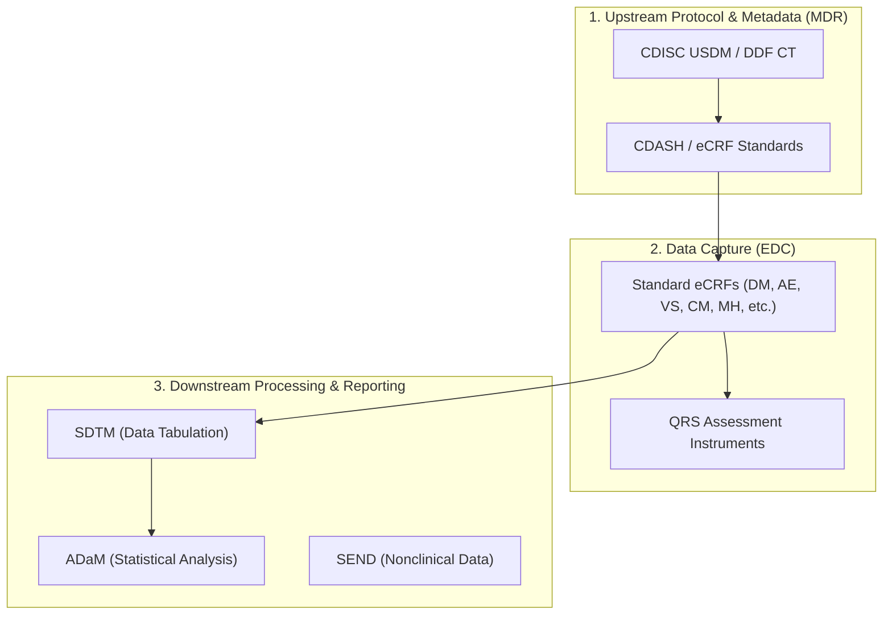

# CDISC Standards & Reference Documentation Guide

This directory (`docs/CDISC/`) contains the complete reference library, specifications, REST API contracts, and controlled terminology for the Clinical Data Interchange Standards Consortium (CDISC) integrated into the **Cadence Clinical Platform**.

The platform leverages these CDISC standards to achieve automated **Digital Data Flow (DDF)** from upstream Clinical Metadata Management (MDR) down to Electronic Data Capture (EDC), SDTM dataset generation, and ADaM statistical analysis.

---

## 🏛️ CDISC Standards Overview & Architecture



---

## 📁 Repository Directory Structure & File Analysis

```text
docs/CDISC/
├── README.md                           # (This File) Comprehensive CDISC Guide
├── cdisc-library-api.json             # CDISC Library REST API Swagger/OpenAPI Spec
├── Latest_Cross_Integrations.docx     # Reference Map for Cross-Standard Linkages
└── Library/
    ├── Data_Collection/               # CDASHIG Models & Standard eCRFs
    ├── Data_Tabulation/               # SDTM & SDTMIG Data Models
    ├── DataAnalysis/                  # ADaM & ADaMIG Statistical Models
    ├── Integrated/                    # TIG (Therapeutic Area Integration Guides)
    ├── QRS_Instruments/               # Questionnaires, Ratings & Scales
    └── Terminology/                   # Controlled Terminology (JSON & XLSX)
```

---

## 🔬 Core Standards & Library Components

### 1. CDISC Library REST API (`cdisc-library-api.json`)

- **File**: `docs/CDISC/cdisc-library-api.json`
- **Purpose**: OpenAPISpec/Swagger representation of the official CDISC Library API.
- **Usage**: Used by Cadence Clinical metadata utilities (`apps/designer/` and `packages/core-models/`) to dynamically query standard codelists, domain structures, and variable definitions.

---

### 2. Data Collection (CDASH & eCRFs)

**Path**: `docs/CDISC/Library/Data_Collection/`

- **Implementation Guides**:
  - `CDASHIG_v2.2.json`: CDASH Implementation Guide v2.2 specification.
  - `CDASHIG_v2.3.json`: CDASH Implementation Guide v2.3 specification.
- **Standard eCRF Domain Templates**:
  - Located under `docs/CDISC/Library/Data_Collection/eCRFs/`. Contains standardized Case Report Forms organized across 20+ clinical domain subdirectories.
  - **Formats Provided**: Each domain includes 5 interoperable representations:
    1. **JSON (`*_Excel.json`)**: Machine-readable eCRF schema for UI form generators.
    2. **Excel (`*_Excel.xlsx`)**: Tabular layout for clinical data managers (CDM).
    3. **HTML (`*_HTML.html`)**: Web preview for browser-based eCRF renderers.
    4. **PDF (`*_PDF.pdf`)**: Printable document for site binders and archives.
    5. **XML (`*_XML.xml`)**: ODM-compliant XML schema for eCRF exchange.

#### Covered eCRF Clinical Domains

| Domain Code | Subdirectory Name | Domain Description |
|-------------|-------------------|--------------------|
| **DM** | `Demographics` | Subject age, sex, race, ethnicity, and baseline characteristics |
| **AE** | `Adverse_Events` | Adverse event tracking, severity, seriousness, and causality |
| **CM** | `Concomitant_Medications` | Prior and concurrent medications, dosages, and indications |
| **VS** | `Vital_Signs` | Blood pressure, pulse, body temperature, height, and weight |
| **MH** | `Medical_History` | Pre-existing medical conditions and surgical history |
| **EG** | `ECG_Central_Reading`, `ECG_Local_Reading` | Central and Local ECG readings |
| **LB** | `Lab_Central`, `Lab_Local` | Central and Local laboratory readings & reference ranges |
| **IE** | `IE` | Protocol inclusion / exclusion criteria fulfillment |
| **DD** | `Death_Details` | Cause of death, autopsy details, and terminal events |
| **PE** | `Physical_Exam` | System-by-system physical examination findings |
| **CE** | `Clinical_Events` | Protocol-defined clinical events and endpoints |
| **SU** | `Substance_Use` | Tobacco, alcohol, and substance use history |
| **HO** | `Healthcare_Encounters` | Inpatient, outpatient, and emergency room visits |
| **RS** | `Disease Response` | Tumor assessment and therapeutic response evaluation |
| **FA** | `Findings` | Supplemental findings related to primary observations |
| **TIG** | `TIG` | Specialized eCRFs for nicotine dependency (`Med_Used`, `Medical_History`, `Informed_Consent`) |

---

### 3. Data Tabulation (SDTM)

**Path**: `docs/CDISC/Library/Data_Tabulation/`

- **Files**:
  - `SDTM_v2.0.json`: Study Data Tabulation Model v2.0 core structure.
  - `SDTM_v2.1.json`: Study Data Tabulation Model v2.1 core structure.
  - `SDTMIG_v3.4.json`: SDTM Implementation Guide v3.4 domain definitions.
- **Role in Cadence Clinical**: Underpins automated transformation of EDC observational data (`apps/execution/sdtm_mapper.py`) into regulatory-compliant SDTM domains (`DM`, `AE`, `VS`, `CM`, `LB`, `EX`, `DS`).

---

### 4. Data Analysis (ADaM)

**Path**: `docs/CDISC/Library/DataAnalysis/`

- **Files**:
  - `ADaMIG_v1.0.json` to `ADaMIG_v1.3.json`: General ADaM Implementation Guides v1.0–v1.3.
  - `ADaM_ADAE_v1.0.json`: Adverse Event Analysis Dataset Structure.
  - `ADaM_BDS_for_TTE_v1.0.json`: Basic Data Structure for Time-to-Event Analysis.
  - `ADaM_OCCDS_v1.0.json` & `v1.1.json`: Occurrence Data Structure specifications.
  - `ADaM_popPK_v1.0.json`: Population Pharmacokinetics Data Structure.
  - `ADaMIG_NCA_v1.0.json`: Non-Compartmental Analysis Implementation Guide.
  - `ADaMIG_MD_v1.0.json`: Medical Devices Implementation Guide.
- **Role in Cadence Clinical**: Exposes biostatistical dataset generation endpoints for regulatory submission analysis pipelines (`packages/core-models/sdtm/`).

---

### 5. Questionnaire, Ratings & Scales (QRS Instruments)

**Path**: `docs/CDISC/Library/QRS_Instruments/`

Standardized clinical assessment supplements provided in structured JSON:

- **`AIMS_Supplement_v2.0.json`**: Abnormal Involuntary Movement Scale.
- **`APACHE_II_Supplement_v1.0.json`**: Acute Physiology and Chronic Health Evaluation II.
- **`ATLAS_Supplement_v1.0.json`**: Asthma Therapy Assessment Questionnaire.
- **`CGI_Supplement_v2.1.json`**: Clinical Global Impression Scale.
- **`HAM-A_Supplement_v2.1.json`**: Hamilton Anxiety Rating Scale.
- **`KFSS_Supplement_v2.0.json`**: Kurtzke Functional Systems Scores.
- **`KPS_SCALE_Supplement_v2.0.json`**: Karnofsky Performance Scale.
- **`PGI_Supplement_v1.1.json`**: Patient Global Impression Scale.
- **`SIX_MINUTE_WALK_Supplement_v1.0.json`**: 6-Minute Walk Test Instrument.

---

### 6. Integrated & Therapeutic Area Standards (TIG)

**Path**: `docs/CDISC/Library/Integrated/` & `docs/CDISC/Latest_Cross_Integrations.docx`

- **Files**:
  - `CDASH_for_TIG_v1.0.json`
  - `SDTM_for_TIG_v1.0.json`
  - `ADaM_for_TIG_v1.0.json`
  - `SEND_for_TIG_v1.0.json` (Standard for Exchange of Nonclinical Data)
  - `Meta_Data.docx` & `Latest_Cross_Integrations.docx`
- **Purpose**: Defines unified data mappings across therapeutic areas, connecting nonclinical, data collection, tabulation, and analysis layers.

---

### 7. Controlled Terminology (CT)

**Path**: `docs/CDISC/Library/Terminology/`

Provides official CDISC Controlled Terminology packages (release version `2024-09-27`). Available in dual formats (**JSON** for instant programmatic lookups and **XLSX** for data manager reference):

- `ADaM_CT_2024-09-27` (.json / .xlsx)
- `CDASH_CT_2024-09-27` (.json / .xlsx)
- `DDF_CT_2024-09-27` (.json / .xlsx)
- `Define-XML_CT_2024-09-27` (.json / .xlsx)
- `Glossary_CT_2024-09-27` (.json / .xlsx)
- `MRCT_CT_2024-09-27` (.json / .xlsx) (Multi-Regional Clinical Trials)
- `Protocol_CT_2024-09-27` (.json / .xlsx)
- `SDTM_CT_2024-09-27` (.json / .xlsx)

---

## 🛠️ Programmatic Usage in Cadence Clinical

Developers and agents can utilize these schemas in Python service modules:

```python
import json
from pathlib import Path

# Load CDASH implementation guide
cdash_path = Path("docs/CDISC/Library/Data_Collection/CDASHIG_v2.3.json")
with open(cdash_path, "r", encoding="utf-8") as f:
    cdash_spec = json.load(f)

# Load Controlled Terminology for SDTM
ct_path = Path("docs/CDISC/Library/Terminology/SDTM_CT_2024-09-27.json")
with open(ct_path, "r", encoding="utf-8") as f:
    sdtm_ct = json.load(f)
```

---

## 💡 Maintenance & Verification Guidelines

1. **Validation**: When updating markdown or adding schemas under `docs/CDISC/`, run `python3 scripts/validate_markdown.py`.
2. **Binary Files**: Word documents (`.docx`) in this directory serve as reference documentation. Do not commit temporary `.docx` outputs during test runs.
3. **Controlled Terminology Updates**: When upgrading CDISC CT releases, keep both `.json` and `.xlsx` files synchronized to maintain fallback parity across APIs and tools.
