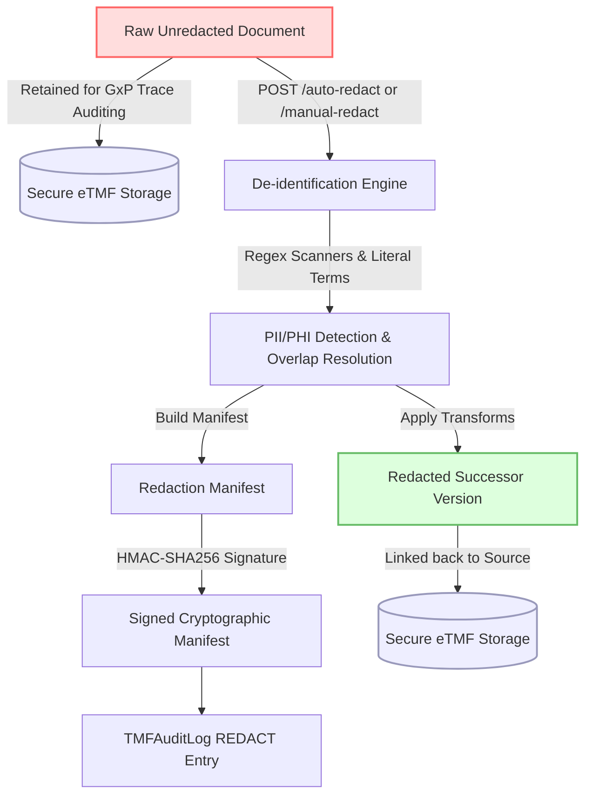

# Data Lifecycle Specification: eTMF Quality Control (QC) Review Lifecycle

## 1. Overview
The electronic Trial Master File (eTMF) Quality Control (QC) Review Lifecycle is a critical, multi-stage data review workflow implemented to guarantee data integrity, completeness, and regulatory compliance under FDA 21 CFR Part 11, GAMP 5, and EU Annex 11.

---

## 2. Document Status Values
Documents in the eTMF progress through the following status values:
- **DRAFT**: The initial, unverified state of a newly ingested or uploaded document.
- **TECHNICAL_QC**: The document is undergoing technical Quality Control checking (e.g., verifying readability, taxonomy mappings, file format compliance, and basic metadata accuracy).
- **CLINICAL_QC**: The document is undergoing clinical Quality Control review to confirm context validity, protocol alignment, and adherence to GCP/ICH standards.
- **APPROVED**: The document has successfully completed all QC phases and is officially approved as an active record in the eTMF.
- **ARCHIVED**: Active clinical records are securely archived once a study milestone or the entire trial reaches completion. This is a terminal state.
- **REJECTED**: A document that fails technical or clinical review is rejected, allowing authors to correct and resubmit it (transitioning back to DRAFT).

---

## 3. Allowed Transitions (Validated State Machine)
To prevent unauthorized state jumps or bypass of QC controls, transitions are strictly governed by a state machine validation gate:

```
[ DRAFT ] ──► [ TECHNICAL_QC ] ──► [ CLINICAL_QC ] ──► [ APPROVED ] ──► [ ARCHIVED ]
                   │                     │                    │
                   ▼                     ▼                    ▼
             [ REJECTED ]          [ REJECTED ]         [ REJECTED ]
                   │
                   ▼
               [ DRAFT ] (Re-submit)
```

- **DRAFT** can only transition to **TECHNICAL_QC**.
- **TECHNICAL_QC** can transition to **CLINICAL_QC** or **REJECTED**.
- **CLINICAL_QC** can transition to **APPROVED** or **REJECTED**.
- **APPROVED** can transition to **ARCHIVED** or **REJECTED**.
- **REJECTED** can transition to **DRAFT** (restarting the review lifecycle).
- **ARCHIVED** is a terminal state; no further transitions are permitted.

---

## 4. Role-Based Access Control (RBAC) Gates
Transitions can only be performed by users holding the designated roles:

| Target Status | Allowed Actor Roles | Description |
| :--- | :--- | :--- |
| **DRAFT** | `sponsor_dm`, `sponsor_clinical`, `admin` | Resubmitting a corrected document or reverting from rejected. |
| **TECHNICAL_QC** | `sponsor_dm`, `admin` | Technical QC review performed by Sponsor Data Managers. |
| **CLINICAL_QC** | `sponsor_clinical`, `admin`, `monitor` | Clinical QC review performed by Clinical Reviewers/Monitors. |
| **APPROVED** | `sponsor_dm`, `sponsor_clinical`, `admin` | Final validation of both technical and clinical verification steps. |
| **ARCHIVED** | `sponsor_dm`, `admin` | Relocating approved active documents to clinical archives. |
| **REJECTED** | `sponsor_dm`, `sponsor_clinical`, `admin` | Rejecting a document from any of the active QC/Approval stages. |

---

## 5. Audit Trail & 21 CFR Part 11 Compliance
Every transition executes under strict electronic signature and auditing controls:
1. **Append-Only History Logs (`DocumentQCTransition`)**: Every successful status transition is persisted in an immutable, append-only ledger tracking:
   - Document ID reference.
   - From status & To status.
   - Actor identity & Actor roles.
   - 21 CFR Part 11 change justification reason (mandatory, minimum 10 characters).
   - Timestamp.
2. **Immutable Audit Trail (`TMFAuditLog`)**: The system automatically registers a parallel record in the global eTMF audit log.

---

# Data Lifecycle Specification: Medical Coding Lifecycle

## 1. Overview
The Medical Coding Engine translates raw, unstructured clinical verbatim descriptions (e.g., adverse events, medical history, or concomitant medications) into standard codes from dictionaries like MedDRA and WHODrug. This workflow supports precise analysis, clinical safety reporting, and submission-ready database generation while enforcing strict regulatory auditing compliance under FDA 21 CFR Part 11.

---

## 2. Ingest → Match → Assignment → Query → Recoding Flow

```
[ raw verbatim ingest ] ────► [ fuzzy matching & scoring ]
                                     │
      ┌──────────────────────────────┼──────────────────────────────┐
      ▼ (Score >= 0.85)              ▼ (Score 0.60 to 0.84)         ▼ (Score < 0.60)
[ AUTO_CODED ]               [ SUGGESTED ]                  [ QUERY_PENDING ]
      │                              │                              │
      │ (auto-promoted)              ▼ (Manual review loop)         ▼ (Triggers EDC Query)
      │                      [ ACCEPT ] or [ OVERRIDE ] ──► [ SYSTEM_CODING query ]
      │                              │                              │
      ▼                              ▼                              ▼ (Resolved by re-verbatim)
[ Active Assignment ] ◄──────────────┴──────────────────────────────┘
      │
      ▼ (Up-versioning dictionary impact)
[ ClinicalCodingLedger ] (Audit historical trail & status transitions)
```

### Stage 1: Ingest (Dictionary Loading)
- **Action**: Standard dictionaries are imported dynamically via the authenticated Gateway.
- **Accountable Roles**: `TERMINOLOGY_MANAGER` and `SYSTEM_ADMIN` hold exclusive privileges.
- **Process**: Parsing handles ASCII files inside `.zip` archives containing either MedDRA format files or WHODrug format files.
- **Auditing**: Records an immutable `DictionaryImportJob` tracking the job state, percentage completion, row counts, errors, and standard audit log entries for full lifecycle traceability.

### Stage 2: Match (Fuzzy Similarity Matching)
- **Process**: Raw text ingested into the system is normalized via:
  - Case folding.
  - Suffix-stripping stemming rules (e.g., stripping `s`, `es`, `ing`, `ed`, `ly`, etc.).
  - Clinical stop-phrase/word removal (e.g., removing words like `acute`, `mild`, `severe`, `history of`, etc.).
- **Scoring**: A hybrid deterministic scorer calculates token alignment:
  $$\text{Score} = 0.4 \times S_{\text{Levenshtein}} + 0.6 \times S_{\text{Cosine}}$$
- **Confidence Gates**:
  1. **AUTO-CODED (Score $\ge$ 0.85)**: High-confidence exact/near-exact matches are linked to standard codes immediately.
  2. **SUGGESTIONS (Score 0.60 to 0.84)**: Up to three ranked code suggestions are stored on the assignment. Status changes to `SUGGESTED`.
  3. **UNCODABLE (Score $<$ 0.60)**: Verbatim strings with low matcher confidence are placed into `QUERY_PENDING`.

### Stage 3: Assignment / Review (Manual Coder Loop)
- **Process**: Data Managers and Coders review and resolve `SUGGESTED` or `QUERY_PENDING` records.
- **Allowed Actions**:
  - **ACCEPT**: Commits suggestion index as final coding meaning.
  - **OVERRIDE**: Manually overrides the code with a verified dictionary concept.
- **Auditing / Part 11**: Coder actions require standard Gateway Signature Version 2 authentication headers, validating credentials and carrying an explicit, non-empty GxP `reason_for_change` justification. Each manual decision is recorded permanently in `ClinicalCodingLedger`.

### Stage 4: Query (Uncodable Query Generation)
- **Process**: For any `UNCODABLE` assignment, the system automatically triggers an open, actionable `ClinicalQuery` with origin `SYSTEM_CODING` and action required `RE-ENTER_VERBATIM`.
- **Identity & PII Isolation**: Query logs specify the exact table, field, and observation coordinates, but omit clinical subject IDs and demographics to maintain blinding and isolate PII data.
- **Resolution Transitions**:
  - Resolving or cancelling the `SYSTEM_CODING` query reverts the assignment status back to `UNCODED`, placing it back into the manual review loop.
  - Conversely, a manual coder action (`ACCEPT` or `OVERRIDE`) on the pending assignment automatically transitions the query status to `CLOSED` and attaches resolution notes.

### Stage 5: Recoding & Up-Versioning Ledger
- **Process**: When a new dictionary version is imported, an impact analysis compares existing coded records.
- **Outcomes**:
  - **Unchanged**: Automatic promotion to the new version.
  - **Reclassified**: Status changed to `RECODING_REQUIRED` with recoding status `PENDING`. Target is flagged for review.
  - **Deprecated**: Assigned code is no longer present; status changes to `RECODING_REQUIRED` and recoding status `PENDING` to trigger manual recoding.
- **Auditing**: Pre-upversioning historical meanings are preserved intact under the original version indices, and transitions are written idempotently to the `ClinicalCodingLedger` to maintain compliance.

---

## 3. Accountable Roles & Access Control Matrix

| Workflow Transition | Required Roles / Privileges | GxP / Part 11 Constraints |
| :--- | :--- | :--- |
| **Dictionary Ingestion** | `TERMINOLOGY_MANAGER`, `SYSTEM_ADMIN` | Synchronous layout verification & transaction rollback on failure. |
| **Fuzzy Matching** | System | Automated, deterministic logic. |
| **Accept Suggestions** | `sponsor_dm` (Data Manager), Coder synonyms | Requires gateway signature validation. |
| **Manual Override** | `sponsor_dm` (Data Manager), Coder synonyms | Requires signature validation + non-empty `reason_for_change`. |
| **Query Closure** | Coder Action or System Event | Automatically synced on manual coder decision. |
| **Impact Analysis** | `TERMINOLOGY_MANAGER`, `SYSTEM_ADMIN` | Idempotent ledger updates. |

---

## 4. Operational & Cache Configuration
- **Cache TTL**: The thread-safe medical coding lookup cache uses a configurable expiration parameter via the `CODING_CACHE_TTL` environment variable (default: `10.0` seconds).
- **Graceful Cache Fallback**: In the event of backend database errors or connectivity failures, the system automatically falls back to serving stale/expired cached results to prevent user interface degradation.
- **Supported Dictionary Formats**:
  - **MedDRA**: Stream parses standard ASCII files including `llt.asc`, `pt.asc`, `hlt.asc`, `hlgt.asc`, `soc.asc`, and `mdhier.asc`.
  - **WHODrug**: Fixed-width format files (e.g., standard B3 DD.txt, ING.txt, ATC.txt, DADA.txt, DI.txt) or delimited (CSV, PSV) text formats using custom mappings and header configurations.
- **Licensed Content Note**: In-repo storage of licensed MedDRA or WHODrug terminology distributions is strictly forbidden. All testing environments must run using small, synthetic, in-memory fixtures.

---

# Data Lifecycle Specification: eTMF Document Redaction Lifecycle

## 1. Overview
The eTMF Document Redaction Lifecycle defines the security boundaries, operational flows, and regulatory data-handling logic for removing Personally Identifiable Information (PII) and Protected Health Information (PHI) from clinical documents before external distribution, auditor review, or public disclosure. This lifecycle fulfills the traceability and verification requirements of **PRD-TMF-005** and **Trace-12**.

---

## 2. Redaction Architecture & System Boundaries



The redaction engine is split into two layers:
1. **Shared Detection Layer (`packages/deid`)**: A pure-Python detection and sanitization package implementing regex-based scans, literal word scans, overlap resolution, transformation strategy application, and cryptographic signature generation.
2. **Service Gateway Layer (`apps/etmf`)**: Exposes `/api/v1/etmf/documents/{document_id}/auto-redact` and `/manual-redact` endpoints. It resolves versions, validates and logs Part 11 justifications, writes non-sensitive audit events, and restricts access to raw unredacted original files.

---

## 3. Compliance Profiles & Regulatory Disclosure Contexts

The de-identification engine implements three discrete, standardized compliance profiles that govern active PII/PHI categories and operational intents:

### HIPAA (US Health Insurance Portability and Accountability Act)
- **Operational Intent**: Satisfies the US "Safe Harbor" de-identification standard for sanitizing documents to be shared with sponsors, research partners, or US regulatory agencies (FDA).
- **Active Categories**: Direct and indirect identifiers (Emails, Phone/Fax Numbers, Social Security / National IDs, IP/MAC Addresses, URLs, ZIP/Geographic codes, Dates, Medical Record/Account Numbers, Age above 89, and custom terms).

### GDPR (EU General Data Protection Regulation)
- **Operational Intent**: Satisfies strict personal data handling rules for clinical subjects and trial coordinators residing in the EU. Focuses on removing direct and indirect identifiers that could lead to identity reconstruction.
- **Active Categories**: Direct and indirect identifiers (Emails, Phone/Fax Numbers, Social Security / National IDs, IP/MAC Addresses, URLs, ZIP/Geographic codes, Dates, Medical Record/Account Numbers, Age above 89, and custom terms).

### EU CTR (European Union Clinical Trials Regulation)
- **Operational Intent**: Focuses on the public-disclosure framing mandated by the EU Clinical Trials Registry (under Regulation EU No 536/2014). Ensures clinical study documents can be published transparently to the public database without revealing any patient identities, while maintaining geographic granularity (ZIP codes and IP addresses) which are relevant to clinical execution and are thus preserved.
- **Active Categories**: Focuses strictly on patient anonymity and direct clinical trial patient identifiers (Emails, Phone/Fax Numbers, Social Security / National IDs, Dates, Medical Record/Account Numbers, Age above 89, and custom terms).

---

## 4. De-identification Transforms & Default Date-Shifting

The engine applies distinct, GxP-compliant transform strategies to the detected matches:
1. **Masking (`mask`)**: Replaces the sensitive value with a standard placeholder (e.g., `[EMAIL]`, `[SSN_NATIONAL_ID]`).
2. **Deterministic Pseudonymization (`pseudonymize`)**: Generates a cryptographically strong, non-reversible, deterministic hash of the verbatim value using HMAC-SHA256 and the workspace `REDACTION_SIGNING_SECRET` / `"internal-gateway-secret-12345"`.
3. **Age Capping (`age_cap`)**: Generalizes age values that exceed a set limit. Standard policy generalizes any age above 89 to `89+`.
4. **Configurable Date-Shifting (`date_shift`)**:
   - **Default Date-Shift Policy**: By default, dates are shifted forward by exactly **365 days** (1 year) to preserve longitudinal intervals (e.g., matching subsequent visits, adverse event spans, or dosing times) while destroying original calendar values.
   - **Configurability**: The date shifting offset is fully configurable via the `shift_days` parameter on the transform execution to handle study-specific anonymization schedules.

---

## 5. Document Version Preservation & Access Boundaries

To satisfy 21 CFR Part 11 electronic records tracing and GxP compliance:
- **Non-Destructive Version Preservation**: Original, unredacted documents are never overwritten. A redaction event increments the document's `version_index` and creates a redacted successor document version linked back to the source version using the `redaction_source_id` reference column.
- **Auditor & Inspector Lock state**: Read-only roles (`auditor`, `inspector`, `regulatory_inspector`) are strictly blocked from accessing the raw, unredacted source documents (returning HTTP 403 Forbidden) once a redacted successor exists. Only write-privileged roles (e.g., Sponsor DM) can view raw originals.
- **Trial Lock Safeguards**: If the clinical study or trial is locked, any subsequent ingestion, manual/automated redaction, or transition attempts are blocked, returning HTTP 403 `IMMUTABILITY_VIOLATION`.

---

## 6. Manifest Signing, Audit Trails & Sensitive Data Restrictions

Every redaction operation creates a highly detailed, immutable cryptographic paper trail:
1. **Signed Redaction Manifest**:
   - A structured Pydantic-based `RedactionManifest` records redaction counts per category, operator identity, change reason justification, source version, target version, and character span metadata.
   - It is signed symmetrically using HMAC-SHA256 with the secret `REDACTION_SIGNING_SECRET`.
   - The signed manifest data is saved permanently inside the redacted document's `redaction_manifest_json` column.
2. **Sensitive-Data Restrictions (PII/PHI Exclusion)**:
   - To maintain blinding and comply with GDPR/HIPAA standards, **raw matched PII/PHI values are strictly excluded from all audit trails, logging records, and manifest files**. Only the category, strategy, and replacement values are preserved.
3. **Immutable Audit Trail Logging**:
   - The system logs a non-sensitive `REDACT` action to the immutable database-backed `TMFAuditLog`, containing the actor ID, roles, source/redacted version indices, and the cryptographic manifest signature to ensure tamper-evident non-repudiation.

---

# Data Lifecycle Specification: Global Library & Clinical Study Instances

## 1. Overview
The Global Library in the Metadata Designer (MDR/SDR) service (`apps/designer`) serves as the central, multi-tenant repository for reusable clinical protocol definitions. This specification defines the data lifecycle, retention rules, and strict tenant partitioning that separate shared global reference templates from trial-specific (study instance) execution data. It ensures system compliance under FDA 21 CFR Part 11, GxP standards, and GDPR multi-tenant guidelines, satisfying **Trace-3**.

---

## 2. Shared Library Objects versus Study-Instance Data

The platform enforces a clear distinction between master template objects and localized trial instances:

```
[ Global Library (Master Data) ] ──────► [ POST /library-instances ] ──────► [ Study Instance (Execution) ]
 - Owned by Sponsor A                     - Copy-on-Instantiation            - Scope bound to Study
 - Versioned via Graph Chains             - Captures source link             - Local Overrides Allowed
 - Locked statuses are Immutable          - Retains pedigree trace           - Lifespan bound to Trial
```

### Global Library Templates (Master Reference Data)
- **Nature**: High-quality, reusable blueprint templates representing clinical design standards (`FORM`, `DATA_ELEMENT`, `ARM`, `VISIT`).
- **Storage**: Persisted as graph nodes inside Neo4j.
- **Auditing & Change Trails**: Modifications create new versioned nodes. Prior states are retained intact and chained linearly using `[:PREVIOUS_VERSION]` relationships to preserve historical protocol reproducibility.

### Study Library Instances (Trial-Specific Data)
- **Nature**: Active, study-scoped configurations instantiated for a particular clinical protocol.
- **Storage**: Persisted as separate `:LibraryObjectInstance` nodes linked to the study root `:Study`.
- **Overrides**: Study teams can customize or override these instantiated templates.
- **Source Linkage**: Upon instantiation, the platform records a strict `[:INSTANTIATED_FROM]` relationship mapping the instance back to the exact source library template version (tracking source ID, version index, and sponsor ID). This guarantees absolute provenance and clinical traceability.
- **Isolation of Modifying Effects**: Local overrides exist purely at the study-instance level. Modifying an instantiated copy has absolutely zero impact on the master Global Library template, preserving the template's purity.

---

## 3. Logical Tenant Partitioning & Sponsor Separation Guidelines

To enforce strict clinical trial separation and prevent cross-sponsor metadata leakage:
1. **Cryptographic Context Verification**: The API Gateway decodes the caller's Keycloak JWT, validates roles, and injects signed headers (`X-Sponsor-Id`, `X-Tenant-Id`) downstream.
2. **Whitespace Gating**: The Metadata Designer service strictly parses incoming sponsor attributes. Write, read, list, or transition attempts are instantly rejected with HTTP 403 Forbidden if the sponsor ID is:
   - Absent or missing.
   - Null or empty (`""`).
   - Whitespace-only (e.g., `"   "`).
3. **Sponsor Boundary Enforcement**: Database queries are strictly scoped. Every query automatically appends a sponsor isolation parameter (e.g. `n.sponsor_id = $sponsor_id`). Callers are completely blocked from reading, listing, updating, or instantiating templates belonging to other sponsors (returning HTTP 404 or 403).

---

## 4. Retention Policy & Lifespan Rules

The operational lifespan of library data and study data is governed by distinct regulatory retention schedules:

| Data Classification | Lifecycle States | Retention Trigger | Compliance Retention Timeline |
| :--- | :--- | :--- | :--- |
| **Global Library Templates** | `DRAFT`, `IN_REVIEW`, `APPROVED`, `PUBLISHED`, `ARCHIVED` | Transition to `ARCHIVED` | Permanently retained as master metadata. Retained for 25 years post-trial completion per clinical master file guidelines. |
| **Study Library Instances** | Active Trial State | Trial Completion or Soft Deletion | Linked directly to the study lifecycle. Retained/archived in parallel with study trial master records. |

### Immutability of Locked Template Statuses
- Once a template version's status is transitioned to `PUBLISHED` or `ARCHIVED`, its payload is locked. Standard `PUT` mutations on these records are strictly blocked at the API layer, raising an `IMMUTABILITY_VIOLATION` (HTTP 403 Forbidden).
- **Formal Amendments**: To evolve a locked or in-use template, users must call `/api/v1/mdr/library/{id}/amend`. This copies the template's payload into a new, separate draft version node (incrementing the version sequence) while keeping existing active studies linked to the original version.

### Non-Destructive Soft-Deletion Guidelines
- Deletions are strictly non-destructive. To prevent historical audit trail breaks, master templates and study instances are never deleted from the database. Instead:
  - Deletions write a new version marked as `is_deleted = true`.
  - The previous active state remains securely preserved in the graph version chain, enabling complete retrospective reconstructibility of any trial configuration at any historical timestamp.
