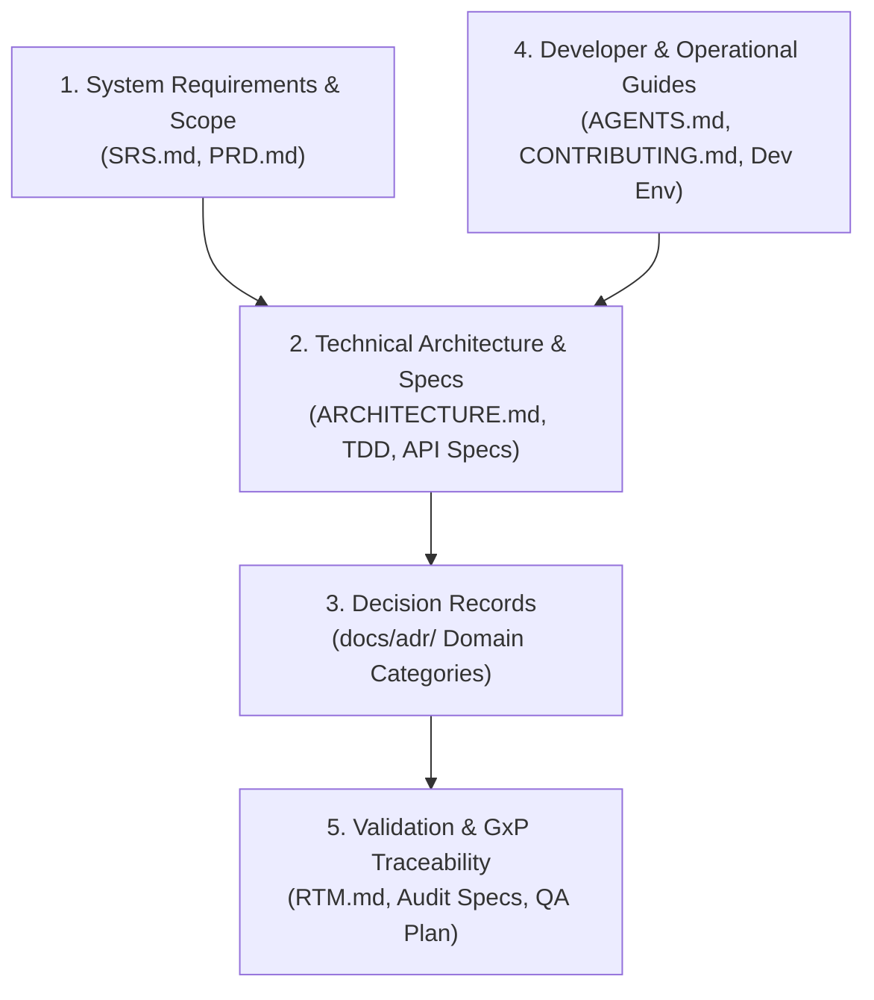

# Cadence Clinical Master Documentation Hub

Welcome to the **Cadence Clinical Platform** master documentation index. This portal provides a structured sitemap, architectural taxonomy, and maintenance guide for developers, system architects, and compliance auditors working with the platform.

---

## Documentation Architecture & Taxonomy

Cadence Clinical documentation is organized into a 5-layer hierarchy to maintain traceability across clinical requirements, architectural design decisions, and GxP compliance ledgers:



---

## 1. System Requirements & Scope
High-level clinical system contracts, product scope, and functional specifications.

- **[System Requirements Specification (SRS)](SRS.md)** (`SRS.md`): Upstream digital data flow (DDF), clinical metadata management, eCRF data model requirements, and system traceability specifications (`Trace-1` through `Trace-N`).
- **[Product Requirements Document (PRD)](SDLC/01_Product_Requirements_Document_PRD.md)** (`01_Product_Requirements_Document_PRD.md`): Functional capabilities, user roles, eClinical workflow definitions, and PRD requirement identifiers (`PRD-SYS-xxx`, `PRD-EDC-xxx`, `PRD-CTMS-xxx`, etc.).

---

## 2. Technical Architecture & Integration Specifications
Deep technical design specifications, database models, and service boundary definitions.

- **[System Architecture Guide](ARCHITECTURE.md)** (`ARCHITECTURE.md`): High-level system architecture, service communication topology, and database split (Neo4j for MDR, PostgreSQL for EDC).
- **[Technical Design Document (TDD)](SDLC/02_Technical_Design_Document_TDD.md)** (`02_Technical_Design_Document_TDD.md`): Internal micro-architecture, database schemas, cryptographic signature specs, and service isolation boundaries.
- **[API Integration Specification](SDLC/03_API_Integration_Specification.md)** (`03_API_Integration_Specification.md`): Gateway routes, request/response payload contracts, RFC 7807 error formats, and authentication propagation headers.
- **[Data Standards & Interoperability Blueprint](SDLC/04_Data_Standards_Interoperability_Blueprint.md)** (`04_Data_Standards_Interoperability_Blueprint.md`): CDISC USDM v3.0/v4.0, CDISC ODM, SDTM/ADaM exports, FHIR/eSource, and MedDRA/WHODrug medical coding integration.

---

## 3. Architectural Decision Records (ADRs)
Immutable chronological records of key architectural and technical decisions made throughout system evolution. All ADRs are categorized into 7 functional domains:

- **[Architectural Decision Records Index](adr/index.md)** (`docs/adr/index.md`): Categorized ADR repository including:
  1. **Core Platform & Engine**: Graph DB, PostgreSQL, Pydantic v2, rules engine, dynamic diffing.
  2. **API Gateway & Security**: Keycloak identity, RBAC, Gateway aggregation, canonical JSON signatures.
  3. **Clinical Data Interoperability & Standards**: USDM v3/v4 mapping, ODM, SDTM/ADaM, FHIR, medical coding.
  4. **Clinical Operations & Business Modules**: CTMS, eTMF, RTSM, eCOA/ePRO, eConsent, SDV/TSDV, Quality/CAPA.
  5. **Compliance, Audit & Governance**: 21 CFR Part 11 Audit Trail, Merkle root sealing, shadow triggers.
  6. **Frontend & Design System**: Vue 3 SPA, pnpm workspace, shared UI primitives, grid layouts.
  7. **DevOps, Tooling & CI/CD**: Parallel testing, DB CLI tool, markdown/ADR validation scripts.

---

## 4. Developer Experience & Operations
Guidelines for setting up, building, running, and contributing code to Cadence Clinical.

- **[Local Development Environment](LOCAL_DEV_ENVIRONMENT.md)** (`LOCAL_DEV_ENVIRONMENT.md`): Setup instructions, environment variables, Docker services, and database migrations.
- **[Issue Structure, Work Streams & Project Board Guide](SDLC/ISSUE_STRUCTURE_GUIDE.md)** (`SDLC/ISSUE_STRUCTURE_GUIDE.md`): Standardized issue formatting, 8 parallel work streams, readiness badges, GitHub Project 17 automation, and DoD requirements.
- **[AI Agent & Development Instructions](AGENTS.md)** (`AGENTS.md`): Architectural guardrails, coding standards, directory targeting rules, and PR verification gates.
- **[Contributing Guidelines](../CONTRIBUTING.md)** (`CONTRIBUTING.md`): Workspace development standards, code style, formatting tools, and the Issue-to-Doc Sync Workflow.
- **[Operations & Deployment Guide](SDLC/07_Operations_Deployment_Guide.md)** (`07_Operations_Deployment_Guide.md`): Production deployment topology, Docker orchestration, monitoring, and database backup protocols.

---

## 5. Validation & GxP Compliance Ledger
GxP audit readiness, requirement traceability, and automated verification reports.

- **[Requirements Traceability Matrix (RTM)](SDLC/Requirements_Traceability_Matrix.md)** (`Requirements_Traceability_Matrix.md`): Automated bidirectional mapping between PRD/SRS requirements, test suite execution results, and ADRs.
- **[Security, Compliance & Audit Spec](SDLC/05_Security_Compliance_Audit_Spec.md)** (`05_Security_Compliance_Audit_Spec.md`): 21 CFR Part 11 compliance matrix, encryption standards, and security vulnerability exclusion ledger.
- **[QA Validation Plan](SDLC/06_QA_Validation_Plan.md)** (`06_QA_Validation_Plan.md`): GAMP 5 validation strategy, testing tiers, and qualification execution standards.
- **[IQ/OQ/PQ Qualification Execution Report](SDLC/IQ_OQ_PQ_Execution_Report.md)** (`IQ_OQ_PQ_Execution_Report.md`): Automated qualification build outputs and release state signatures.

---

## Developer Guide: Issue-to-Doc Synchronization Workflow

When working on a new GitHub issue or modifying system functionality, follow this 3-tier cascade to ensure documentation remains in sync:

1. **Requirement Level (`PRD` / `SRS`)**:
   - Check if the change introduces new user capabilities or modifies existing specifications.
   - If so, update `docs/SDLC/01_Product_Requirements_Document_PRD.md` or `docs/SRS.md` with a unique requirement ID (`PRD-SYS-xxx` or `Trace-x`).
2. **Architecture & Decision Level (`ADR`)**:
   - If the change introduces new dependencies, database model changes, shared package utilities, or gateway routes, create a new ADR using the CLI tool:
     ```bash
     python3 scripts/create_adr.py --title "Your Architectural Decision Title" --domain "core-platform" --req "PRD-SYS-001"
     ```
3. **Traceability Level (`RTM`)**:
   - Write automated pytest or vitest unit/integration tests referencing the requirement ID or feature.
   - Run `python3 scripts/generate_rtm.py` or build docs via `node scripts/build-docs.js` to refresh the Requirements Traceability Matrix.
